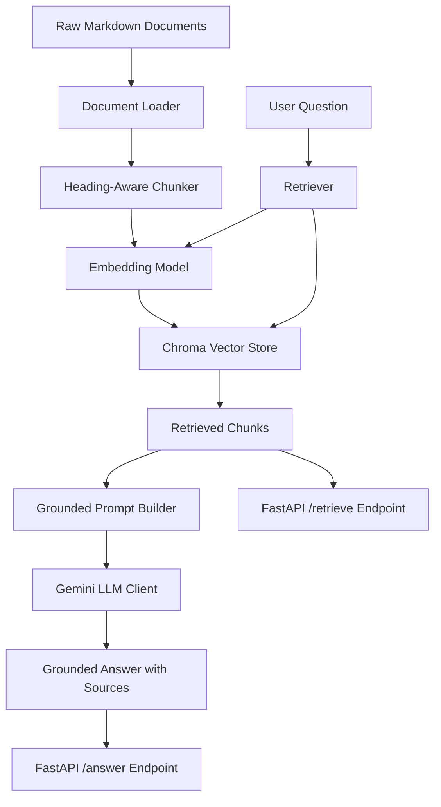

# Architecture

## Overview

The Banking Knowledge RAG Assistant is a Retrieval-Augmented Generation system for answering banking and fintech knowledge questions using source-grounded document context.

The project separates the RAG pipeline into clear layers:

```text
Raw Documents
↓
Document Loading + Metadata Inference
↓
Heading-Aware Chunking
↓
Embedding Generation
↓
Chroma Vector Store with Metadata
↓
Filtered Semantic Retrieval
↓
Grounded Prompt Building
↓
Gemini Answer Generation
↓
FastAPI Response
```

## High-Level Flow



## Main Layers

### Core Layer

Location:

```text
src/banking_rag/core/
```

Purpose:

- shared configuration
- shared Pydantic schemas
- custom exceptions

Key files:

```text
config.py
schemas.py
exceptions.py
```

### Ingestion Layer

Location:

```text
src/banking_rag/ingestion/
```

Purpose:

- load raw markdown documents
- split documents into meaningful chunks
- build the vector index

Key files:

```text
document_loader.py
chunker.py
indexer.py
```

The chunker is heading-aware. This keeps related banking knowledge together by section rather than splitting blindly by character count.

### Retrieval Layer

Location:

```text
src/banking_rag/retrieval/
```

Purpose:

- create local embeddings
- store and query vectors in Chroma
- return clean retrieved chunks with source metadata

Key files:

```text
embedding_model.py
vector_store.py
retriever.py
```

The embedding model is lazy-loaded so tests can import the project without immediately loading PyTorch or Sentence Transformers.

### Generation Layer

Location:

```text
src/banking_rag/generation/
```

Purpose:

- build grounded prompts
- call Gemini for answer generation

Key files:

```text
prompt_builder.py
llm_client.py
```

The prompt explicitly tells the model to use only the retrieved context and avoid inventing unsupported details.

### Service Layer

Location:

```text
src/banking_rag/services/
```

Purpose:

- combine retrieval and generation
- run retrieval evaluation

Key files:

```text
rag_service.py
evaluation_service.py
```

### API Layer

Location:

```text
src/banking_rag/api/
```

Purpose:

- expose the project through FastAPI endpoints
- keep API request/response schemas separate from internal schemas
- support dependency overrides for testing

Key files:

```text
app.py
routes.py
schemas.py
dependencies.py
```

## API Endpoints

```text
GET  /health
POST /retrieve
POST /answer
```

### `/retrieve`

Returns relevant evidence chunks only.

This is useful for debugging retrieval quality.

### `/answer`

Runs the full RAG pipeline:

```text
question → retrieval → grounded prompt → Gemini → answer with sources
```

## Docker Runtime

The Docker container builds the Chroma knowledge base at startup:

```text
container starts
↓
run_index.py builds Chroma
↓
FastAPI server starts
```

This makes the project portable even if the local machine has environment-specific issues with PyTorch or Sentence Transformers.

## Testing Strategy

The project uses unit tests and API tests.

Tests avoid live LLM calls by using fake retrievers and fake LLM clients. This keeps the test suite fast, deterministic, and safe to run in CI.

GitHub Actions runs:

```text
pytest
docker build
```