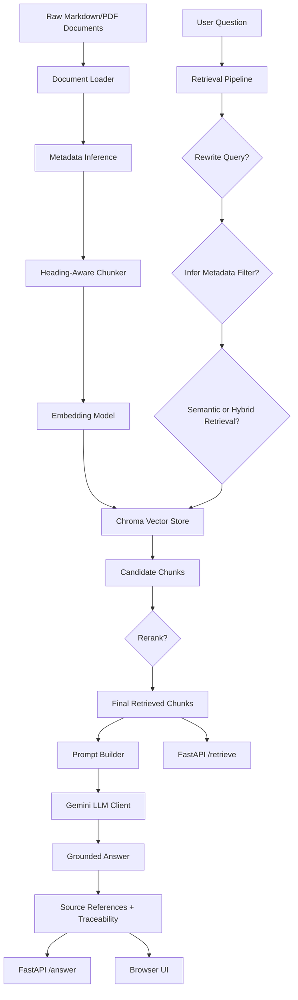

# Architecture

## Overview

The Banking Knowledge RAG Assistant is a Retrieval-Augmented Generation system for answering banking and fintech support questions using source-grounded document context.

The project is split into clear layers so that ingestion, retrieval, generation, evaluation, API serving, and the browser UI can be developed and tested independently.

```text
Raw documents
        ↓
Document loading and metadata inference
        ↓
Heading-aware chunking
        ↓
Embedding generation
        ↓
Chroma vector store with metadata
        ↓
Retrieval pipeline
        ↓
Grounded prompt building
        ↓
Gemini answer generation
        ↓
FastAPI API and browser UI
        ↓
Evaluation and CI quality gates
```

---

## High-Level Flow



---

## Main Layers

### Core Layer

Location:

```text
src/banking_rag/core/
```

Purpose:

- shared configuration
- shared Pydantic schemas
- custom exceptions

Key files:

```text
config.py
schemas.py
exceptions.py
```

The core schemas define the common objects used across the project, including raw documents, document chunks, retrieved chunks, RAG answers, source references, evaluation results, and report summaries.

---

### Ingestion Layer

Location:

```text
src/banking_rag/ingestion/
```

Purpose:

- load raw knowledge documents
- infer basic document metadata
- split documents into meaningful chunks
- build the Chroma index

Key files:

```text
document_loader.py
chunker.py
indexer.py
```

The ingestion layer supports Markdown documents and basic PDF ingestion. PDFs are extracted page by page and converted into markdown-like sections so the existing chunking pipeline can preserve page-level traceability.

The chunker is heading-aware. This keeps related banking knowledge together by section rather than splitting blindly by character count.

---

### Retrieval Layer

Location:

```text
src/banking_rag/retrieval/
```

Purpose:

- create local embeddings
- store and query vectors in Chroma
- run semantic, keyword, hybrid, filtered, rewritten, and reranked retrieval

Key files:

```text
embedding_model.py
vector_store.py
retriever.py
keyword_search.py
hybrid_retriever.py
filter_router.py
query_rewriter.py
reranker.py
retrieval_pipeline.py
```

The embedding model is lazy-loaded so tests can import the project without immediately loading PyTorch or Sentence Transformers.

The reusable `RetrievalPipeline` coordinates the advanced retrieval flow:

```text
original query
        ↓
optional conservative query rewriting
        ↓
optional automatic metadata filtering
        ↓
semantic or hybrid candidate retrieval
        ↓
optional lightweight reranking
        ↓
final retrieved chunks
```

---

### Generation Layer

Location:

```text
src/banking_rag/generation/
```

Purpose:

- build grounded prompts
- call Gemini for answer generation

Key files:

```text
prompt_builder.py
llm_client.py
```

The prompt builder tells the model to answer only from retrieved context, avoid unsupported banking details, cite sources, and treat retrieved documents as untrusted evidence rather than instructions.

---

### Service Layer

Location:

```text
src/banking_rag/services/
```

Purpose:

- combine retrieval and generation
- run retrieval evaluation
- run generated-answer evaluation
- validate citations
- write evaluation reports
- provide deterministic mock answers for offline evaluation

Key files:

```text
rag_service.py
evaluation_service.py
advanced_evaluation_service.py
answer_evaluation_service.py
citation_validation_service.py
evaluation_report_writer.py
mock_answer_service.py
```

The service layer keeps business logic out of the API routes and makes the system easier to test.

---

### API Layer

Location:

```text
src/banking_rag/api/
```

Purpose:

- expose the project through FastAPI endpoints
- keep API schemas separate from internal schemas
- support dependency overrides for testing
- serve the lightweight browser UI

Key files:

```text
app.py
routes.py
schemas.py
dependencies.py
frontend_routes.py
```

The API exposes:

```text
GET  /
GET  /health
POST /retrieve
POST /answer
```

`/` serves the browser UI.

`/health` checks service health.

`/retrieve` returns evidence chunks without generating an answer.

`/answer` runs the full RAG pipeline and returns an answer, sources, retrieved chunks, and traceability fields.

---

### Web UI Layer

Location:

```text
src/banking_rag/web/
```

Purpose:

- provide a simple browser demo without React or a separate frontend server
- make the project easier to show than Swagger-only testing
- display the answer, sources, retrieved chunks, and retrieval trace

Key files:

```text
templates/index.html
static/styles.css
static/app.js
```

The UI sends a JSON request to `/answer` and renders the response in the browser.

---

## Docker Runtime

The Docker container builds the Chroma knowledge base at startup before starting FastAPI:

```text
container starts
        ↓
run_index.py builds Chroma
        ↓
FastAPI server starts
        ↓
browser UI and API endpoints are available
```

Docker is also useful on Windows machines where local security policy may block PyTorch DLLs used by Sentence Transformers.

---

## Testing Strategy

The project uses unit tests, service tests, API tests, and frontend route tests.

Tests avoid live LLM calls by using fake clients, fake retrievers, and mock answer services where appropriate. This keeps the test suite fast, deterministic, and safe for CI.

The CI pipeline runs:

```text
pytest
        ↓
offline RAG answer evaluation quality gate
        ↓
upload evaluation reports
        ↓
Docker image build
```

---

## Traceability

The `/answer` API response includes trace fields that show how retrieval was performed:

- original question
- retrieval query
- metadata filter
- retrieval mode
- rerank status
- query rewrite status
- rewrite reason
- retrieved source chunks

This is important because RAG systems need to be debuggable. When the answer changes, the developer can inspect whether the change came from query rewriting, filtering, retrieval, reranking, prompting, or LLM generation.

---

## PDF Ingestion Flow

PDF documents are processed using a simple page-aware ingestion flow:

```text
PDF file
        ↓
extract text page by page
        ↓
clean extracted text
        ↓
convert each page into a markdown-like section
        ↓
RawDocument
        ↓
heading-aware chunker
        ↓
DocumentChunk with page metadata
```

This keeps PDF ingestion compatible with the existing Markdown chunking pipeline while preserving page-level metadata such as file type and page number.
